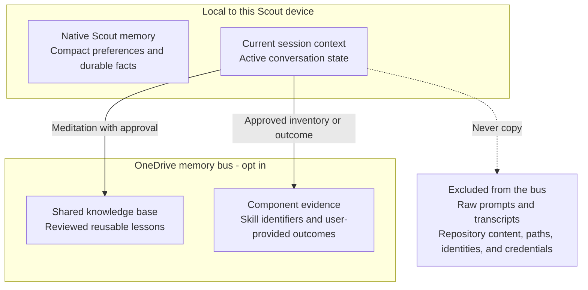
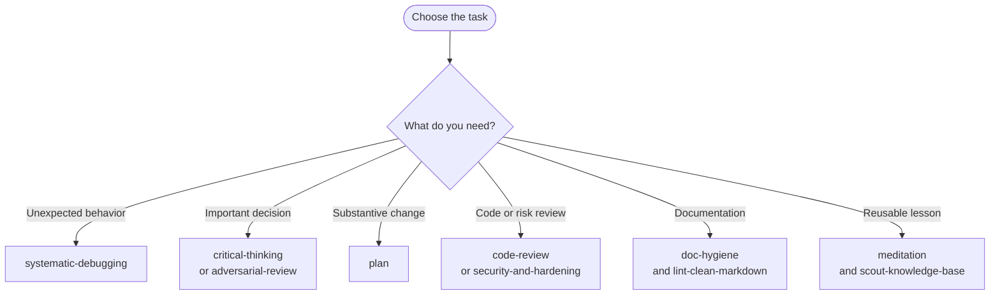
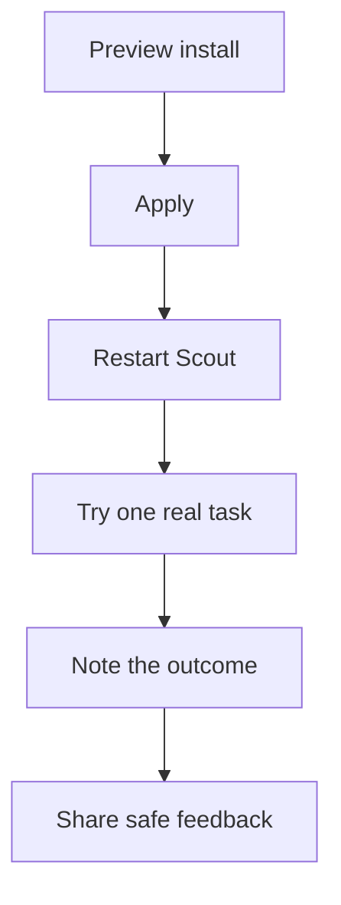

# Alex ACT Scout


Microsoft Scout-compatible packaging for a curated Alex ACT skill set.

Alex ACT Scout converts Core-derived reasoning, review, planning, communication,
and documentation skills into Microsoft Scout's local skill format, and adopts
selected compatible capabilities from adjacent Alex ACT projects. It also owns
Scout-native shared knowledge capture. It is a curated package, not a
byte-for-byte copy of a source plugin.

**Current release: `v2.0.5`.** The package ships 32 core skills, six optional
visual skills, preview-first installers, and tested shared-continuity scripts.
Collect and review user feedback before changing skill behavior.

## What you get

| Content | Count | Location |
| --- | ---: | --- |
| Core workflow skills | 28 | `skills/<skill-name>/SKILL.md` |
| Adopted Brain Compiler skill | 1 | `skills/compile-brain/SKILL.md` |
| Component evidence skill | 1 | `skills/component-evidence/SKILL.md` |
| Shared-data setup skill | 1 | `skills/scout-shared-data-setup/SKILL.md` |
| Package orientation skill | 1 | `skills/alex-act-core/SKILL.md` |
| Optional visual add-on skills | 6 | `skills-visual/<skill-name>/SKILL.md` |
| Complementary instructions | 14 | `skills/<related-skill>/resources/instructions/` |
| Complementary slash prompts | 5 | `skills/<related-skill>/resources/prompts/` |
| Documentation, assets, and catalogs | - | `docs/`, `assets/`, `scout-skills.json`, `scout-skills-visual.json` |

The skills cover critical thinking, adversarial review, systematic debugging, TDD, risk analysis, communication craft, markdown hygiene, Mermaid diagrams, MCP building, security hardening, skill-file optimization, component evidence, status reporting, the Alex Finch personality, shared knowledge capture, and related ACT practices. VS Code-specific skills from the source package are intentionally excluded because their tool assumptions do not transfer cleanly to Scout.

## Flagship capabilities

Alex ACT Scout supports shared continuity through a knowledge-base command that
validates and deposits reviewed lessons while updating a shared index. Scout
never guesses a OneDrive path.

Use:

- `scout-knowledge-base` for durable shared lessons and cross-instance knowledge capture.
- `meditation` for end-of-session lesson extraction into the shared knowledge base.
- `scout-shared-data-setup` to initialize shared evidence and knowledge-base storage on a new device.
- `scout-greeting-checkin` to inspect package readiness at the start of a session.
- [Knowledge base guide](docs/KNOWLEDGE-BASE.md) for the shared lesson-capture process.

## Session bookends for testers

Use the two session-boundary skills around meaningful testing, without turning
routine work into ceremony.


1. **Open:** Start with `scout-greeting-checkin` when a new session begins. It
   performs a short, read-only check of the installed package, shared-data
   readiness, optional Flint setup, and available releases. It reports only
   actionable deviations and never installs, updates, or changes configuration
   on its own.
2. **Work:** Use the relevant skills for the actual task. A health check is not
   a prerequisite for productive work; fix a reported deviation only when it
   matters to the task.
3. **Close:** Use `meditation` before compacting, closing, deleting, or moving
   on from a session that produced a reusable lesson. It extracts only
   verified, privacy-safe lessons; inventories explicitly used Alex ACT Scout
   skills; and asks for approval before recording anything or compacting the
   session.

If the session was routine or yielded no reusable learning, meditation should
state that no knowledge-base record is warranted. Do not use it as a transcript
archive.

## The OneDrive memory bus

The OneDrive memory bus is an opt-in, user-selected synchronized folder that
gives Scout installations a shared continuity layer. Each device points to its
own local sync path for the same folder; Scout never assumes a OneDrive,
SharePoint, or other cloud location.

The bus has two narrow payloads:

| Payload | Location | Purpose |
| --- | --- | --- |
| Shared lessons | `<shared-sync-root>\knowledge-base` | Searchable, reviewed decisions, procedures, failure modes, anti-patterns, and gotchas for future sessions and Scout instances. |
| Component evidence | `<shared-sync-root>\component-evidence-data` | Privacy-minimizing records of explicitly used skills and user-provided usefulness outcomes. |

Run `scout-shared-data-setup` on each device to preview the folders and local
configuration, then approve the setup explicitly. The local configuration
stores only the selected path. The shared bus does **not** replace Scout's
native memory, which remains suitable for compact preferences and durable
facts, and it does not store raw prompts, transcripts, repository content,
paths, identities, credentials, or other private source material.



### Flint charts

The optional visual add-on makes **Flint** a flagship capability for creating
and verifying charts in Scout. It provides chart framing, chart vocabulary,
Flint chart authoring, render verification, and print-safe SVG guidance. Its
local MCP runtime is installed only when you explicitly choose
`-WithFlintMcp` or `--with-flint-mcp`.

Use:

- `chart-big-idea` to define what a chart must communicate.
- `chart-vocabulary` to select an appropriate chart type and encoding.
- `flint-chart` to create or refine charts through the Flint MCP tools.
- `render-verify` to check visible output before delivery.
- [Visual add-on guide](docs/VISUAL-ADDON.md) for installation and runtime setup.

Other high-impact skills worth calling out:

| Skill | Why it matters |
| --- | --- |
| `systematic-debugging` | Keeps bug work root-cause-first instead of guess-and-check. |
| `meditation` | Turns important session experience into reusable knowledge-base records and can inventory traceable skill use. |
| `scout-knowledge-base` | Preserves battle-tested lessons before sessions are closed or deleted. |
| `critical-thinking` | Forces alternatives, disconfirmers, evidence quality, and bias checks before consequential decisions. |
| `plan` | Turns larger changes into concrete, verifiable task sequences before implementation. |
| `big-idea` | Distills the central claim before summaries, PR titles, ADRs, slide titles, and executive framing. |
| `compile-brain` | Produces review-first, execution-ready drafts for selected skills, instructions, prompts, agents, or brain contracts. |
| `component-evidence` | Combines structural importance, meditation inventories, and explicit local outcome records without retaining task content. |
| `scout-shared-data-setup` | Configures the approval-first shared storage required by evidence and knowledge capture. |
| `scout-greeting-checkin` | Checks package readiness at session start and offers, but never applies, maintenance. |
| `git-workflow` | Routes GitHub CLI access to a matching personal account before repository operations. |
| `flint-chart` | Creates data-driven charts with the optional Flint MCP runtime. |
| `security-and-hardening` | Adds a safety pass for auth, input handling, storage, integrations, and untrusted data. |
| `doc-hygiene` | Reduces stale docs, wrong counts, dead links, and documentation drift. |
| `alex-finch-personality` | Gives Scout a consistent ACT-aligned stance: concise, skeptical, calibrated, and user-agency preserving. |

## Find your first skill



## Quick start

### Prerequisites

- Microsoft Scout installed on the tester's device.
- Git installed to clone the package.
- PowerShell on Windows, or Bash on macOS/Linux.

### Install the core skills

1. Clone the repository and enter its root:

   ```powershell
   git clone https://github.com/fabioc-aloha/Alex_ACT_Scout.git
   cd Alex_ACT_Scout
   ```

2. Preview the install plan. The preview does not change Scout.

   Windows:

   ```powershell
   .\install.ps1
   ```

   macOS/Linux:

   ```bash
   ./install.sh
   ```

3. Apply the install after reviewing the preview.

   Windows:

   ```powershell
   .\install.ps1 -Apply
   ```

   macOS/Linux:

   ```bash
   ./install.sh --apply
   ```

4. Restart Scout so its skill inventory refreshes.
5. Ask Scout for a relevant skill by name, for example:

   ```text
   Use the systematic-debugging skill to investigate this failing test.
   ```

Existing Scout skills are not overwritten by default. To refresh an existing Alex ACT Scout install:

```powershell
.\install.ps1 -Apply -Force
```

```bash
./install.sh --apply --force
```

See [Installer script](docs/INSTALLER.md) for Windows and macOS/Linux parameters, cleanup behavior, custom destinations, and troubleshooting.

## Try it and share observations

This package is maintained independently by a Scout power user, not the
Microsoft Scout product team. Volunteers can help establish whether these
workflows improve real work.



1. Clone and install with the quick-start steps above, then restart Scout.
2. Choose one real task and one relevant skill. Good starting points include
   `critical-thinking`, `systematic-debugging`, `plan`, `code-review`, and
   `doc-hygiene`.
3. Use the skill normally, then share your observation directly with the person
   who shared the package.

Include only:

- the task type;
- the skill you tried;
- whether it **helped**, was **neutral**, or was **not helpful**; and
- what made the workflow better, worse, or unnecessarily difficult.

Do not include repository content, prompts, customer data, credentials, or
other private task details. This volunteer feedback is separate from product
telemetry and does not require the `component-evidence` skill. Negative results
are useful: they help identify where a workflow adds friction without enough
value.

## Sample prompts

Use these as starting points. Replace the bracketed text with your task context.

| Skill | Sample prompt |
| --- | --- |
| `critical-thinking` | `Use critical-thinking to evaluate [option A] versus [option B] for [decision]. State the strongest competing explanations, missing evidence, key disconfirmers, and your recommendation.` |
| `systematic-debugging` | `Use systematic-debugging to investigate [failure or unexpected behavior]. Reproduce it, trace the root cause, and propose the smallest tested fix.` |
| `plan` | `Use plan to create an implementation plan for [change]. Include the smallest safe steps, affected files, risks, and validation.` |
| `code-review` | `Use code-review on the current changes. Focus on correctness, security, edge cases, and test coverage; cite evidence for each finding.` |
| `doc-hygiene` | `Use doc-hygiene to review [README or document] against the current project. Find stale claims, broken links, duplicate guidance, and missing adoption information.` |
| `compile-brain` | `Use compile-brain to improve [explicit path to SKILL.md, instruction, prompt, or agent]. Show the complete draft and explain material changes before writing anything.` |
| `git-workflow` | `Use git-workflow to confirm the GitHub CLI account before accessing [owner/repository]. Switch only after showing the selected account and receiving approval.` |
| `scout-greeting-checkin` | `Use scout-greeting-checkin to check the Alex ACT Scout installation, shared data, Flint, and available releases before we begin.` |
| `meditation` | `Use meditation to identify reusable, privacy-safe lessons from this session and inventory the Alex ACT Scout skills explicitly used.` |

## Optional visual add-on

The visual add-on installs chart-authoring and render-verification skills separately from the core ACT package. It includes Flint chart authoring, Flint MCP runtime setup, chart Big Idea framing, chart vocabulary, render verification, and print-safe SVG guidance.

Preview and apply the visual skills:

```powershell
.\install-visual.ps1
.\install-visual.ps1 -Apply
```

```bash
./install-visual.sh
./install-visual.sh --apply
```

To include Flint MCP runtime setup and Scout MCP registration:

```powershell
.\install-visual.ps1 -Apply -WithFlintMcp
```

```bash
./install-visual.sh --apply --with-flint-mcp
```

On the Microsoft network, route the Flint package install through the package feed proxy without changing global npm configuration:

```powershell
.\install-visual.ps1 -Apply -WithFlintMcp -NpmRegistry 'https://packagefeedproxy.microsoft.io/npm/'
```

```bash
./install-visual.sh --apply --with-flint-mcp --npm-registry 'https://packagefeedproxy.microsoft.io/npm/'
```

Restart Scout after MCP registration. See [Visual add-on](docs/VISUAL-ADDON.md) and the [live Flint chart gallery](docs/FLINT-CHART-GALLERY.html).

## Documentation

- [Changelog](CHANGELOG.md) records notable unreleased and released changes.
- [End-user guide](docs/END-USER-GUIDE.md) explains installation, usage patterns, recommended starting skills, and troubleshooting.
- [Installer script](docs/INSTALLER.md) documents `install.ps1` parameters and behavior.
- [Visual add-on](docs/VISUAL-ADDON.md) documents the optional visual skill pack and Flint setup.
- [Live Flint chart gallery](docs/FLINT-CHART-GALLERY.html) renders every chart on demand with the selected Flint theme.
- [Knowledge base guide](docs/KNOWLEDGE-BASE.md) documents shared, privacy-safe lesson capture.
- [Conversion guide](docs/CONVERSION-GUIDE.md) documents the criteria and process for converting Alex ACT Core or similar Copilot plugins into Scout skills.
- [Alex Finch reference](docs/ALEX-FINCH.md) preserves the source identity reference.
- [Skill catalog JSON](scout-skills.json) lists every generated skill name, description, and path.

## Repository layout

```text
Alex_ACT_Scout
|-- install.ps1
|-- install.sh
|-- install-visual.ps1
|-- install-visual.sh
|-- scout-skills.json
|-- scout-skills-visual.json
|-- skills
|   |-- act-tenets
|   |-- systematic-debugging
|   |-- critical-thinking
|   |   `-- resources
|   |       |-- instructions
|   |       `-- prompts
|   `-- status-reporting
|-- skills-visual
|   |-- flint-chart
|   |-- flint-chart-mcp
|   |-- chart-big-idea
|   |-- chart-vocabulary
|   |-- render-verify
|   `-- print-svg-style-guide
|-- docs
|   |-- README.md
|   |-- END-USER-GUIDE.md
|   |-- INSTALLER.md
|   |-- VISUAL-ADDON.md
|   |-- FLINT-CHART-GALLERY.html
|   |-- KNOWLEDGE-BASE.md
|   |-- CONVERSION-GUIDE.md
|   |-- ALEX-FINCH.md
`-- assets
```

Scout loads a skill when it appears as a folder containing `SKILL.md` under `%USERPROFILE%\.scout\skills`. Scout skills can also carry supporting files in the same folder, which is how this package preserves the original prompts and instructions that complemented each source skill.

## How conversion works

GitHub Copilot and Scout use different extension models:

| Source type in Alex ACT Core | Scout representation |
| --- | --- |
| `.github/skills/<name>/SKILL.md` | Copied directly to `skills/<name>/SKILL.md` |
| `.github/instructions/*.instructions.md` | Attached to the related skill under `resources/instructions/` |
| `.github/prompts/*.prompt.md` | Attached to the related skill under `resources/prompts/` |
| Supporting examples/references | Preserved inside the relevant skill folder |

Converted instructions are not automatically always-on in Scout. They are available as supporting resources beside the skill they originally complemented. Each resource-backed skill has a `resources/RESOURCE-INDEX.md` file that lists the attached prompts and instructions.

The source `browser-tools` and `platform-awareness` skills are omitted from this Scout package because they depend on VS Code Copilot tool names and platform behavior rather than Scout's runtime tools.

## Common usage examples

| Goal | Try this |
| --- | --- |
| Debug a failing test or unexpected behavior | `systematic-debugging` |
| Invoke the Alex Finch runtime stance | `alex-finch-personality` |
| Challenge a design decision before implementation | `critical-thinking` or `adversarial-review` |
| Review code for correctness and risk | `code-review` or `security-and-hardening` |
| Plan non-trivial work before coding | `plan` |
| Optimize a selected skill, instruction, prompt, or agent | `compile-brain` |
| Measure structural importance and recorded usefulness | `component-evidence` |
| Configure shared evidence and knowledge-base storage | `scout-shared-data-setup` |
| Check package readiness at the start of a session | `scout-greeting-checkin` |
| Access a GitHub repository with the correct account | `git-workflow` |
| Create and verify a data-driven chart | `chart-big-idea`, `chart-vocabulary`, `flint-chart`, and `render-verify` |
| Write or repair markdown docs | `doc-hygiene`, `lint-clean-markdown`, or `markdown-mermaid` |
| Produce stakeholder updates | `status-reporting` or `communication-craft` |
| Preserve ACT operating rules as an explicit workflow | `act-tenets`, then read `resources/instructions/act-pass.instructions.md` if needed |

## Updating from Alex ACT Core

This repository is a converted snapshot. To update it from a newer source repository, regenerate or re-copy the skill folders, update `scout-skills.json`, and reinstall with:

```powershell
.\install.ps1 -Apply -Force
```

Then restart Scout.

## Troubleshooting

| Problem | Fix |
| --- | --- |
| Skills do not appear in Scout | Confirm folders were copied to `%USERPROFILE%\.scout\skills`, then restart Scout. |
| An existing skill was not updated | Re-run `.\install.ps1 -Apply -Force`. |
| A converted instruction does not run automatically | Read it from the related skill's `resources/instructions/` folder, or copy its body into Scout's standing instruction mechanism. |
| A skill name is hard to discover | Search `scout-skills.json` or ask Scout to use `alex-act-core` for orientation. |

## License and source

This package preserves the source license in [LICENSE](LICENSE). Source provenance is documented through the conversion guide.
