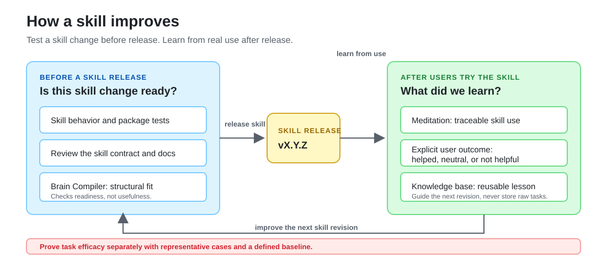
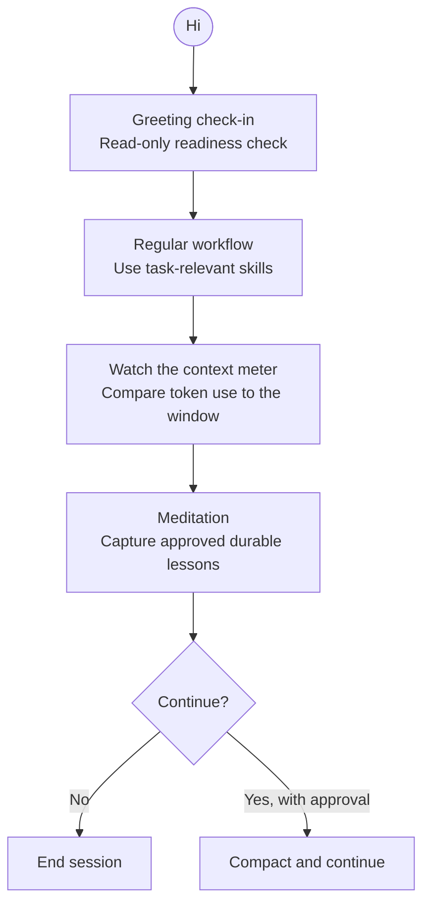
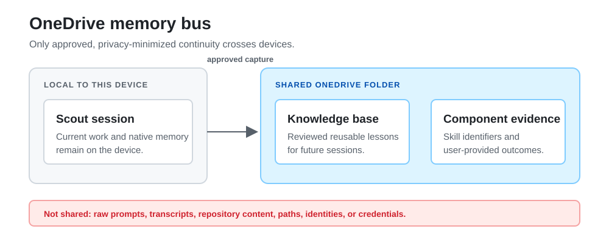

# Alex ACT Scout


Installable Microsoft Scout skills for disciplined analysis, engineering work,
documentation, and shared learning across sessions.

Alex ACT Scout converts selected reasoning, review, planning, communication,
and documentation workflows from Alex ACT Core into Scout skills. It also
includes Scout-native knowledge capture. The package is adapted for Scout; it
is not a byte-for-byte copy of the source plugin.

**Current release: `v2.0.6`.** The package ships 32 core skills, six optional
visual skills, preview-first installers, and shared-continuity scripts. Change
skill behavior only after reviewing tester feedback.

## Package contents

| Package content | Count | Location |
| --- | ---: | --- |
| Core workflow skills | 28 | `skills/<skill-name>/SKILL.md` |
| Adopted Brain Compiler skill | 1 | `skills/compile-brain/SKILL.md` |
| Component evidence skill | 1 | `skills/component-evidence/SKILL.md` |
| Shared-data setup skill | 1 | `skills/scout-shared-data-setup/SKILL.md` |
| Package orientation skill | 1 | `skills/alex-act-core/SKILL.md` |
| Optional visual add-on skills | 6 | `skills-visual/<skill-name>/SKILL.md` |
| Complementary instructions | 14 | `skills/<related-skill>/resources/instructions/` |
| Complementary slash prompts | 5 | `skills/<related-skill>/resources/prompts/` |
| Documentation, assets, and catalogs | - | `docs/`, `assets/`, `scout-skills.json`, `scout-skills-visual.json` |

The core skills cover critical thinking, adversarial review, systematic
debugging, test-driven development, risk analysis, communication, Markdown,
Mermaid, MCP building, security hardening, skill-file revision, component
evidence, status reporting, and shared knowledge capture. VS Code-specific
source skills are excluded when their required tools are unavailable in Scout.

## Shared continuity

Use the continuity skills to resume work with reviewed lessons instead of
copying task details between sessions. A user selects the synchronized folder;
Scout never infers a OneDrive path.

Use:

- `scout-knowledge-base` to search or store reviewed lessons that another Scout
  session can reuse.
- `meditation` to decide whether a closing session produced a reusable lesson.
- `scout-shared-data-setup` to preview and configure shared evidence and
  knowledge-base storage on a new device.
- `scout-greeting-checkin` to read package, shared-data, Flint, and release
  readiness at session start.
- [Knowledge base guide](docs/KNOWLEDGE-BASE.md) for storage and privacy rules.

## Skill development: evidence before release, learning after

Skills improve through two distinct feedback loops. Before releasing a skill
change, focused behavior and package tests, human review, and a structural
assessment establish whether it is ready to distribute. Those checks do not
prove that the skill improves real work. After users try a released skill,
`component-evidence`, meditation, and the knowledge base record
privacy-minimized use, explicit user outcomes, and reusable lessons that inform
the next skill revision.



## Session bookends for testers

Use these steps when testing a workflow that may produce a reusable lesson.
Skip meditation after routine work that produces none.



1. **Open:** Start with `scout-greeting-checkin` when a new session begins. It
   performs a short, read-only check of the installed package, shared-data
   readiness, optional Flint setup, and available releases. It reports only
   actionable deviations and never installs, updates, or changes configuration
   on its own.
2. **Work:** Run the skill selected for the task. The opening check does not
   block work; fix a reported deviation only when it affects the task.
3. **Close:** Use `meditation` before compacting, closing, deleting, or moving
   on from a session that produced a reusable lesson. It extracts only
   verified, privacy-safe lessons; inventories explicitly used Alex ACT Scout
   skills; and asks for approval before recording anything or compacting the
   session.

If the session was routine or yielded no reusable learning, meditation should
state that no knowledge-base record is warranted. Do not use it as a transcript
archive.

## The OneDrive memory bus

The OneDrive memory bus is an opt-in, user-selected synchronized folder for two
controlled data sets shared between Scout devices. Each device points to its
own local sync path; Scout never assumes a OneDrive, SharePoint, or other cloud
location.

The bus has two narrow payloads:

| Payload | Location | Purpose |
| --- | --- | --- |
| Shared lessons | `<shared-sync-root>\knowledge-base` | Searchable, reviewed decisions, procedures, failure modes, anti-patterns, and gotchas for future sessions and Scout instances. |
| Component evidence | `<shared-sync-root>\component-evidence-data` | Privacy-minimizing records of explicitly used skills and user-provided usefulness outcomes. |

Run `scout-shared-data-setup` on each device to preview the folders and local
configuration, then approve the setup explicitly. The local configuration
stores only the selected path. The shared bus does **not** replace Scout's
native memory, which remains suitable for compact preferences and durable
facts, and it does not store raw prompts, transcripts, repository content,
paths, identities, credentials, or other private source material.

Only approved, privacy-minimized continuity crosses devices.



### Flint charts

The optional visual add-on adds tools for choosing, creating, and inspecting
charts in Scout: chart framing, chart selection, Flint authoring, render
inspection, and print-safe SVG guidance. Its local MCP runtime installs only
when you explicitly choose
`-WithFlintMcp` or `--with-flint-mcp`.

Use:

- `chart-big-idea` to define what a chart must communicate.
- `chart-vocabulary` to select an appropriate chart type and encoding.
- `flint-chart` to create or refine charts through the Flint MCP tools.
- `render-verify` to check visible output before delivery.
- [Visual add-on guide](docs/VISUAL-ADDON.md) for installation and runtime setup.

## Start with these skills

| Skill | Use it to |
| --- | --- |
| `systematic-debugging` | Trace a failure to its cause before changing code. |
| `meditation` | Capture a verified lesson at session close and inventory skills used. |
| `scout-knowledge-base` | Search or store reviewed lessons that future sessions can reuse. |
| `critical-thinking` | Compare competing explanations and name evidence that could change a decision. |
| `plan` | Write file-specific implementation steps and validation before non-trivial work. |
| `big-idea` | State the reader takeaway before writing a summary, title, or executive framing. |
| `compile-brain` | Draft a revised skill, prompt, instruction, agent, or contract for review before writing it. |
| `component-evidence` | Keep structural, traceable-use, and explicit outcome evidence separate from task content and efficacy claims. |
| `scout-shared-data-setup` | Preview and configure the shared storage used by knowledge capture and component evidence. |
| `scout-greeting-checkin` | Read package readiness at session start without changing anything. |
| `git-workflow` | Match GitHub CLI access to the repository owner before repository operations. |
| `flint-chart` | Build a data chart through the optional Flint MCP runtime. |
| `security-and-hardening` | Review input handling, authentication, storage, and integrations for security risks. |
| `doc-hygiene` | Find stale claims, broken links, duplicate guidance, and missing adoption information. |
| `alex-finch-personality` | Apply a concise, skeptical, calibrated stance that keeps consequential choices with the user. |

## Quick start

### Prerequisites

- Microsoft Scout installed on the tester's device.
- Git installed to clone the package.
- PowerShell on Windows, or Bash on macOS/Linux.

### Install the core skills

1. Clone the repository and enter its root:

   ```powershell
   git clone https://github.com/fabioc-aloha/Alex_ACT_Scout.git
   cd Alex_ACT_Scout
   ```

2. Preview the install plan. The preview does not change Scout.

   Windows:

   ```powershell
   .\install.ps1
   ```

   macOS/Linux:

   ```bash
   ./install.sh
   ```

3. Apply the install after reviewing the preview.

   Windows:

   ```powershell
   .\install.ps1 -Apply
   ```

   macOS/Linux:

   ```bash
   ./install.sh --apply
   ```

4. Restart Scout so its skill inventory refreshes.
5. Ask Scout for a relevant skill by name, for example:

   ```text
   Use the systematic-debugging skill to investigate this failing test.
   ```

Existing Scout skills are not overwritten by default. To refresh an existing Alex ACT Scout install:

```powershell
.\install.ps1 -Apply -Force
```

```bash
./install.sh --apply --force
```

See [Installer script](docs/INSTALLER.md) for Windows and macOS/Linux parameters, cleanup behavior, custom destinations, and troubleshooting.

## Test a skill and report the result

This package is maintained independently, not by the Microsoft Scout product
team. Tester feedback determines whether a workflow stays, changes, or is
removed.

1. Clone and install with the quick-start steps above, then restart Scout.
2. Choose a task whose result you can judge and one skill to try. Start with
   `critical-thinking`, `systematic-debugging`, `plan`, `code-review`, and
   `doc-hygiene`.
3. Run the skill, then send the result to the package maintainer.

Include only:

- the task type;
- the skill you tried;
- whether it **helped**, was **neutral**, or was **not helpful**; and
- what made the workflow useful, unhelpful, or unnecessarily difficult.

Do not include repository content, prompts, customer data, credentials, or
other private task details. This volunteer feedback is separate from product
telemetry and does not require the `component-evidence` skill. A not-helpful
result identifies a workflow that needs revision or removal.

## Sample prompts

Use these as starting points. Replace the bracketed text with your task context.

| Skill | Sample prompt |
| --- | --- |
| `critical-thinking` | `Use critical-thinking to evaluate [option A] versus [option B] for [decision]. State the strongest competing explanations, missing evidence, key disconfirmers, and your recommendation.` |
| `systematic-debugging` | `Use systematic-debugging to investigate [failure or unexpected behavior]. Reproduce it, trace the root cause, and propose the smallest tested fix.` |
| `plan` | `Use plan to create an implementation plan for [change]. Include the smallest safe steps, affected files, risks, and validation.` |
| `code-review` | `Use code-review on the current changes. Focus on correctness, security, edge cases, and test coverage; cite evidence for each finding.` |
| `doc-hygiene` | `Use doc-hygiene to review [README or document] against the current project. Find stale claims, broken links, duplicate guidance, and missing adoption information.` |
| `compile-brain` | `Use compile-brain to improve [explicit path to SKILL.md, instruction, prompt, or agent]. Show the complete draft and explain material changes before writing anything.` |
| `git-workflow` | `Use git-workflow to confirm the GitHub CLI account before accessing [owner/repository]. Switch only after showing the selected account and receiving approval.` |
| `scout-greeting-checkin` | `Use scout-greeting-checkin to check the Alex ACT Scout installation, shared data, Flint, and available releases before we begin.` |
| `meditation` | `Use meditation to identify reusable, privacy-safe lessons from this session and inventory the Alex ACT Scout skills explicitly used.` |

## Optional visual add-on

The visual add-on installs separately from the core package. It includes Flint
chart authoring, Flint MCP runtime setup, chart claim framing, chart selection,
render inspection, and print-safe SVG guidance.

Preview and apply the visual skills:

```powershell
.\install-visual.ps1
.\install-visual.ps1 -Apply
```

```bash
./install-visual.sh
./install-visual.sh --apply
```

To include Flint MCP runtime setup and Scout MCP registration:

```powershell
.\install-visual.ps1 -Apply -WithFlintMcp
```

```bash
./install-visual.sh --apply --with-flint-mcp
```

On the Microsoft network, use the package-feed proxy for Flint only. This does
not change global npm configuration:

```powershell
.\install-visual.ps1 -Apply -WithFlintMcp -NpmRegistry 'https://packagefeedproxy.microsoft.io/npm/'
```

```bash
./install-visual.sh --apply --with-flint-mcp --npm-registry 'https://packagefeedproxy.microsoft.io/npm/'
```

Restart Scout after MCP registration. See [Visual add-on](docs/VISUAL-ADDON.md) and the [live Flint chart gallery](docs/FLINT-CHART-GALLERY.html).

## Documentation

- [Changelog](CHANGELOG.md) records notable unreleased and released changes.
- [End-user guide](docs/END-USER-GUIDE.md) explains installation, usage patterns, recommended starting skills, and troubleshooting.
- [Installer script](docs/INSTALLER.md) documents `install.ps1` parameters and behavior.
- [Visual add-on](docs/VISUAL-ADDON.md) documents the optional visual skill pack and Flint setup.
- [Live Flint chart gallery](docs/FLINT-CHART-GALLERY.html) renders every chart on demand with the selected Flint theme.
- [Knowledge base guide](docs/KNOWLEDGE-BASE.md) documents shared, privacy-safe lesson capture.
- [Conversion guide](docs/CONVERSION-GUIDE.md) documents the criteria and process for converting Alex ACT Core or similar Copilot plugins into Scout skills.
- [Alex Finch reference](docs/ALEX-FINCH.md) preserves the source identity reference.
- [Skill catalog JSON](scout-skills.json) lists every generated skill name, description, and path.

## Repository layout

```text
Alex_ACT_Scout
|-- CHANGELOG.md
|-- install.ps1
|-- install.sh
|-- install-visual.ps1
|-- install-visual.sh
|-- LICENSE
|-- package.json
|-- scout-skills.json
|-- scout-skills-visual.json
|-- VERSION
|-- skills
|   |-- act-tenets
|   |-- systematic-debugging
|   |-- critical-thinking
|   |   `-- resources
|   |       |-- instructions
|   |       `-- prompts
|   `-- status-reporting
|-- skills-visual
|   |-- flint-chart
|   |-- flint-chart-mcp
|   |-- chart-big-idea
|   |-- chart-vocabulary
|   |-- render-verify
|   `-- print-svg-style-guide
|-- docs
|   |-- README.md
|   |-- ALEX-FINCH.md
|   |-- CONVERSION-GUIDE.md
|   |-- DEFENSIBLE-DECISION-FLINT-GALLERY.html
|   |-- END-USER-GUIDE.md
|   |-- FLINT-CHART-GALLERY.html
|   |-- INSTALLER.md
|   |-- KNOWLEDGE-BASE.md
|   `-- VISUAL-ADDON.md
`-- assets
    |-- banner.svg
    |-- onedrive-memory-bus.svg
    |-- scout.png
    `-- skill-evidence-lifecycle.svg
```

Scout loads a skill when it appears as a folder containing `SKILL.md` under `%USERPROFILE%\.scout\skills`. Scout skills can also carry supporting files in the same folder, which is how this package preserves the original prompts and instructions that complemented each source skill.

## How conversion works

GitHub Copilot and Scout use different extension models:

| Source type in Alex ACT Core | Scout representation |
| --- | --- |
| `.github/skills/<name>/SKILL.md` | Copied directly to `skills/<name>/SKILL.md` |
| `.github/instructions/*.instructions.md` | Attached to the related skill under `resources/instructions/` |
| `.github/prompts/*.prompt.md` | Attached to the related skill under `resources/prompts/` |
| Supporting examples/references | Preserved inside the relevant skill folder |

Converted instructions are not automatically always-on in Scout. They are available as supporting resources beside the skill they originally complemented. Each resource-backed skill has a `resources/RESOURCE-INDEX.md` file that lists the attached prompts and instructions.

The source `browser-tools` and `platform-awareness` skills are omitted from this Scout package because they depend on VS Code Copilot tool names and platform behavior rather than Scout's runtime tools.

## Choose a skill by task

| Task | Start with |
| --- | --- |
| Debug a failing test or unexpected behavior | `systematic-debugging` |
| Invoke the Alex Finch runtime stance | `alex-finch-personality` |
| Challenge a design decision before implementation | `critical-thinking` or `adversarial-review` |
| Review code for correctness and risk | `code-review` or `security-and-hardening` |
| Plan non-trivial work before coding | `plan` |
| Optimize a selected skill, instruction, prompt, or agent | `compile-brain` |
| Measure structural importance and recorded usefulness | `component-evidence` |
| Configure shared evidence and knowledge-base storage | `scout-shared-data-setup` |
| Check package readiness at the start of a session | `scout-greeting-checkin` |
| Access a GitHub repository with the correct account | `git-workflow` |
| Create and verify a data-driven chart | `chart-big-idea`, `chart-vocabulary`, `flint-chart`, and `render-verify` |
| Write or repair markdown docs | `doc-hygiene`, `lint-clean-markdown`, or `markdown-mermaid` |
| Produce stakeholder updates | `status-reporting` or `communication-craft` |
| Preserve ACT operating rules as an explicit workflow | `act-tenets`, then read `resources/instructions/act-pass.instructions.md` if needed |

## Updating from Alex ACT Core

This repository is a converted snapshot. To update it from a newer source repository, regenerate or re-copy the skill folders, update `scout-skills.json`, and reinstall with:

```powershell
.\install.ps1 -Apply -Force
```

Then restart Scout.

## Troubleshooting

| Problem | Fix |
| --- | --- |
| Skills do not appear in Scout | Confirm folders were copied to `%USERPROFILE%\.scout\skills`, then restart Scout. |
| An existing skill was not updated | Re-run `.\install.ps1 -Apply -Force`. |
| A converted instruction does not run automatically | Read it from the related skill's `resources/instructions/` folder, or copy its body into Scout's standing instruction mechanism. |
| A skill name is hard to discover | Search `scout-skills.json` or ask Scout to use `alex-act-core` for orientation. |

## License and source

This package preserves the source license in [LICENSE](LICENSE). Source provenance is documented through the conversion guide.
