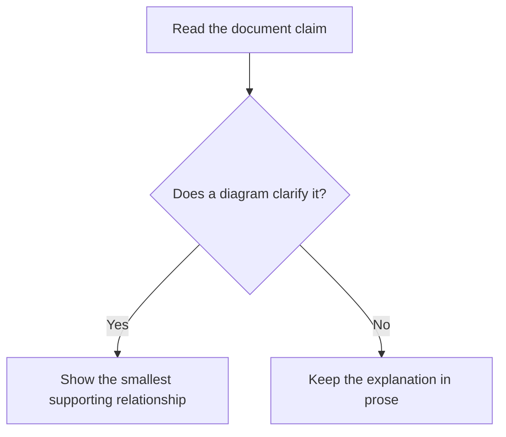

# Diagram visual arguments

Mermaid syntax is native capability. This skill adds judgment: a diagram must
help a reader understand the document's central claim, fit its surrounding
context, and stay accurate as that context changes. Choose a custom SVG when
its deliberate composition communicates the claim better than Mermaid can.

## When to use

Use this skill when you are:

- deciding whether a Markdown section needs a diagram;
- creating or revising a Mermaid diagram or custom SVG;
- updating prose beside an existing diagram;
- checking whether a diagram still represents an edited document; or
- diagnosing a diagram that renders but communicates poorly.

Do not use it for data analysis, decorative visuals, screenshots, or
free-form whiteboards. Use a charting tool for data and prose when prose makes
the point more clearly. If the optional visual add-on is installed, use
`flint-chart` for data and `render-verify` for a rendered visual. In a
core-only installation, inspect the available target renderer or ask the user
to confirm the visual result.

## Shared Knowledge Gate

Before a consequential or repeated diagram decision, consult
`scout-knowledge-base` for relevant visual, documentation, or rendering
lessons. Read only records whose conditions match the task, and treat them as
context rather than authority. If none are available, continue with the
document evidence.

## Diagram brief

Read the section heading, nearby prose, captions, and any existing diagram
before choosing a diagram type. Derive, do not invent, this brief:

| Field | Question |
| --- | --- |
| Big Idea | What should a reader understand at a glance? |
| Reader | Who needs that understanding, and for what decision or action? |
| Evidence | Which steps, relationships, states, or boundaries support the claim? |
| Omission | What detail would distract from the claim? |
| Risk | What false inference could the diagram create? |

If the Big Idea is unclear, ask for it before drawing. A topic inventory is
not a visual argument.

## Decide whether a diagram earns its place

Add or keep a Mermaid diagram only when it makes at least one of these easier
to understand than concise prose or a table:

- sequence, handoff, or feedback loop;
- decision with materially different outcomes;
- relationship, dependency, or system boundary;
- state transition or failure path; or
- recurring abstraction that benefits from a stable visual anchor.

Apply the deletion test: if the surrounding prose reads just as clearly after
removing the diagram, do not add it or recommend removing it.

## Select the smallest fitting form

| Reader needs to see | Use | Avoid |
| --- | --- | --- |
| Process, decision, dependency, or boundary | `flowchart` | A broad architecture map that repeats every paragraph |
| Request and response order | `sequenceDiagram` | A flowchart that obscures who acts |
| Stable structural relationships | `classDiagram` or `erDiagram` | Pretending an implementation sequence is a static model |
| State changes and allowed transitions | `stateDiagram` | A flowchart with unlabeled state changes |
| Composition, precise geometry, or hierarchy carries the claim | Custom SVG | Forcing Mermaid to imitate a designed figure |
| Values, distributions, or time series | A chart | A Mermaid diagram used as a chart |

Prefer the form the reader can explain back in one sentence. Split an
overloaded diagram or use prose if no small form fits.

## Choose custom SVG when it fits better

Choose a custom SVG when raw Mermaid would obscure the Big Idea because the
reader needs:

- deliberate spatial composition, alignment, or visual hierarchy;
- precise label placement or collision control;
- non-flow geometry such as a conceptual model, annotated system boundary, or
  recurring document figure; or
- a stable authored layout that must remain legible in its target context.

Do not choose SVG merely to decorate a simple process, decision, relationship,
or state. In those cases, raw Mermaid is easier to maintain and less likely to
drift.

For a custom SVG, keep the file self-contained: define a `viewBox`, include a
useful `<title>` and `role="img"`, use system fonts, and avoid scripts or
external assets. If the optional visual add-on is installed, use
`print-svg-style-guide` for authored-figure hygiene and `render-verify` to
inspect the target output. The same Diagram brief and Document drift check
apply: the SVG must carry the claim, preserve the document's terminology, and
be updated or surfaced when the context changes.

## Author raw Mermaid

Keep Mermaid source portable and let the target renderer own presentation.

- Use a fenced `mermaid` block with ordinary Mermaid syntax only.
- Do not add theme initialization, palette declarations, node classes,
  `classDef`, `linkStyle`, `style`, or renderer-specific layout overrides.
- Keep each node to one idea; move sentence-length explanation into prose.
- Use labels that match the terms and order used in the surrounding document.
- Prefer a top-down flow for a sequential story unless comparison is the point.
- Use `<br/>` only when a node needs a meaningful label break; do not use
  literal `\n`.
- Do not rely on color to convey meaning.



Place the diagram under a heading or beside a short sentence that states its
Big Idea. The reader should not need to infer why the visual exists.

## Verify the diagram or SVG

When the target renderer is available, inspect the rendered diagram rather
than treating valid source as sufficient. Check that:

1. the visual supports the Big Idea without contradicting nearby prose;
2. labels are readable, complete, and not clipped or overlapped;
3. nodes and edges tell the intended order, ownership, or boundary;
4. the diagram is not wider, taller, or denser than its reader needs; and
5. the source remains raw and portable.

If the target renderer is unavailable, state that rendering was not inspected.
Do not claim visual verification from source review alone.

## Document drift check

Whenever you edit a Markdown document containing Mermaid or a custom SVG,
inspect each nearby diagram before completing the edit. Compare the diagram
with:

- the section's current Big Idea;
- named actors, systems, and boundaries;
- step order, decisions, outcomes, and failure paths;
- scope, audience, and time references; and
- the sentence or caption that introduces the diagram.

If any of those disagree, surface the issue before leaving the document:

```text
**Diagram drift**: <diagram or section> still shows <old claim or relationship>,
but the updated text now says <current claim or relationship>. Recommended
response: <update the diagram, revise the prose, or remove the diagram>.
```

Do not silently leave a diagram that you observed to be stale. Fix a
terminology-only mismatch when the meaning is unchanged. When the correction
would change the document's claim, scope, or intended reader decision, present
the drift and let the user choose the resolution.

## Anti-patterns

| Anti-pattern | Correction |
| --- | --- |
| Diagram repeats the paragraph | Remove it or make the relationship visible rather than restating prose. |
| Diagram maps a topic, not a claim | Return to the Diagram brief and state the reader takeaway. |
| Diagram has more detail than its section | Split it or replace it with prose or a table. |
| Labels use different terms than the document | Align the vocabulary before rendering. |
| Edited prose changes an actor, sequence, or outcome | Run the Document drift check and surface the mismatch. |
| Mermaid obscures a layout-dependent claim | Choose a custom SVG with deliberate composition. |
| Custom SVG only decorates a simple relationship | Replace it with raw Mermaid or prose. |
| Valid source is treated as a successful visual | Inspect the target render or state that it was not inspected. |

## Related skills

- `big-idea` for the document claim the diagram must carry.
- `render-verify` for inspection of an available rendered visual (optional
  visual add-on).
- `print-svg-style-guide` when a custom SVG is the better form (optional
  visual add-on).
- `flint-chart` and `chart-vocabulary` when the reader needs a data chart
  rather than a relationship diagram.
- `doc-hygiene` when document structure or adjacent claims may have drifted.

## Would revise if

Revise this skill if repeated use produces diagrams that readers identify as
decorative, if Document drift alerts are consistently false positives, or if
raw Mermaid source fails across supported target renderers often enough to
require a documented portability exception. Revisit the SVG selection gate if
it produces decoration rather than clearer reader understanding.
